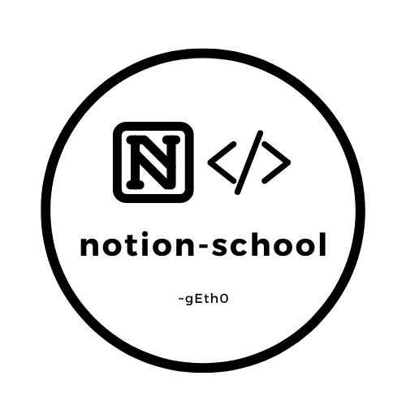
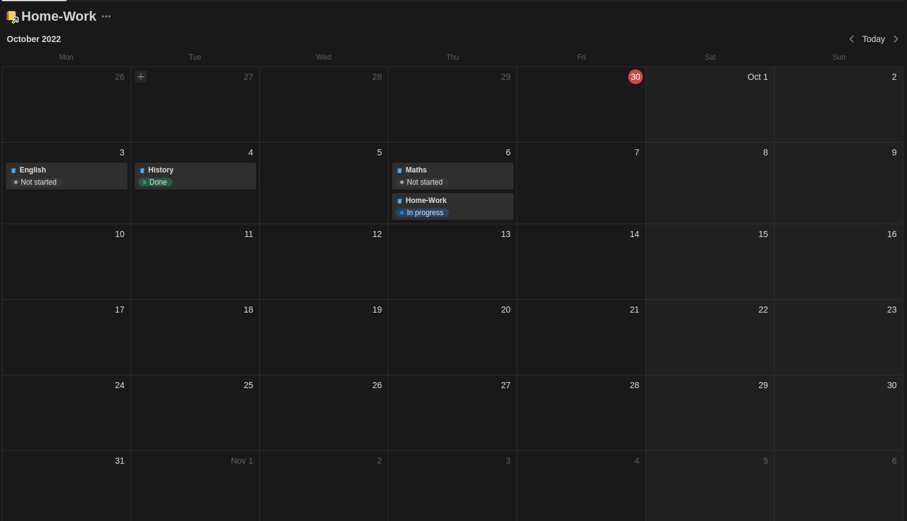
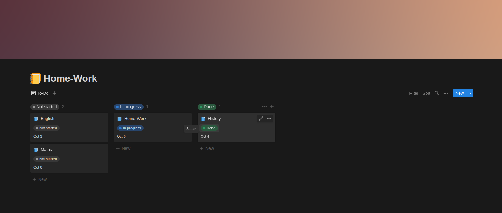
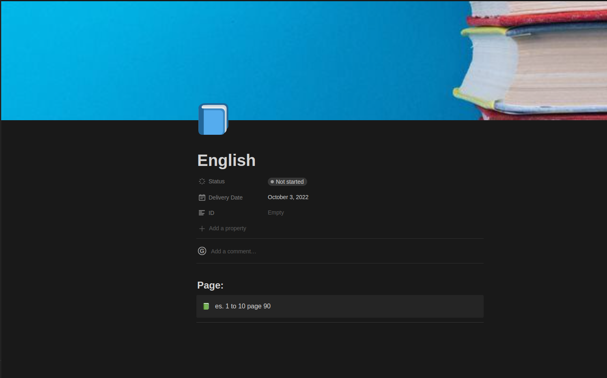

<p align="center">
  
</p>

# notion-school

## 📘 A Little Help For Your School Productivity 📘

You've been so bothered by searching for tasks on different platforms; not to have a simple and well-organized calendar view and to-do lists enough to make you want to study? Well I've the right software for you!
<br>
## Features :

<p align="center">
    <h2>📍 Minimalist and Organized Calendar View</h2>
  
</p>

<p align="center">
    <h2>📍 To-Do Kanban Board Style (3 columns)</h2>
  
</p>

<p align="center">
    <h2>📍 Single Pages With Complete Assignments</h2>
  
</p>

# Python
First install all the dependencies needed typing : 
```python
pip install -r requirements.txt
```
Then simply run main.py file with :
```python
python main.py
``` 
or 
```python
python3 main.py
``` 
# Docker
Download .tar archive from [release](https://github.com/gEth0/notion-school/releases) tab up here.

<br>

Then type :
```docker
- docker image load -i ".tar archive"
- docker run -ti notion-school-publ:0.1.0
```
or build your image at the moment (RECOMMENDED) by typing :
```docker
- docker build -t notion-school-pub:latest .
- docker run -ti notion-school-publ:latest
```
# How it works :
It connects via API at classeviva's servers, dump all of assignments and agenda homeworks.
Then with Notion API upload all the assignments in TO-DO list and calendar view.
# Credentials : 
When successfully running on your machine it'll prompt you to insert some credentials and informations : 
- First you have to enter notion-db id(find online how to obtain it)
- Then you have to enter your notion-secret-token (you have to login to [notion developers page](https://developers.notion.com/))
- Lastly you have to enter your classeviva's credentials
# Found an Issue?
### Report it by create a [new issue](https://github.com/gEth0/notion-school/issues/new)

# Refs :
 ##### 🙌 Special Thanks to [@zmoog](https://github.com/zmoog)
###### New features and improvements coming soon!
## gEth0 💯 
